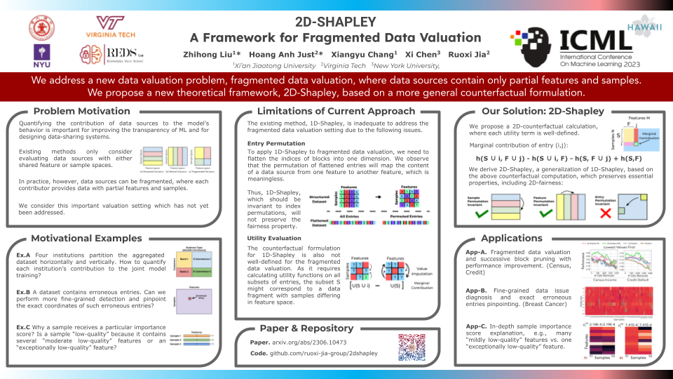

# 2D-Shapley: A Framework for Fragmented Data Valuation


This repository is the official implementation of the "[2D-Shapley: A Framework for Fragmented Data Valuation](https://arxiv.org/abs/2306.10473)" (ICML 2023). 





We address a new data valuation problem, fragmented data valuation, where data sources contain only partial features and samples.
We propose a new theoretical framework, 2D-Shapley, based on a more general counterfactual formulation.


# Getting Started

## Requirements

Install a virtual environment (conda).

```
conda env create -f environment.yaml python=3.8
```

                        
## Examples

For better understanding of applying 2D-Shapley to fragmented data valuation, we have provided an example notebook on [Breast Cancer Dataset](breast_cancer_example.ipynb).

## Data

The selected datasets are included in the folder ['data'](data).


## Acknoledgment

Xiangyu Chang's work was partly supported by the National Natural Science Foundation for Outstanding Young Scholars of China under Grant 72122018 and partly by the Natural Science Foundation of Shaanxi Province under Grant 2021JC-01. Xi Chen would like to thank the support from NSF via the Grant IIS-1845444. RJ and the ReDS lab would like to thank the support from NSF via the Grant OAC-2239622.


